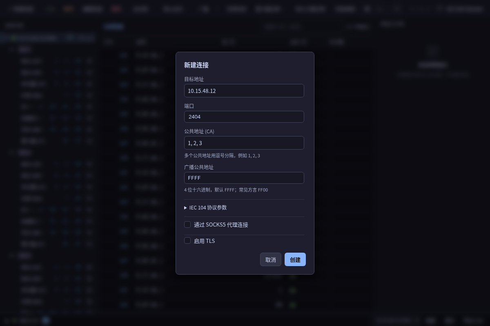
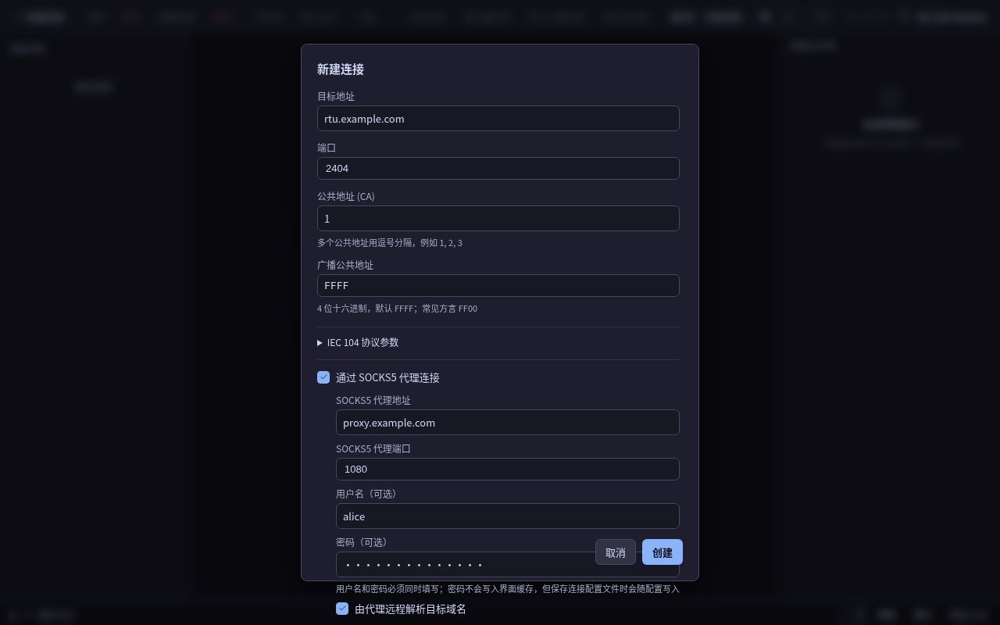
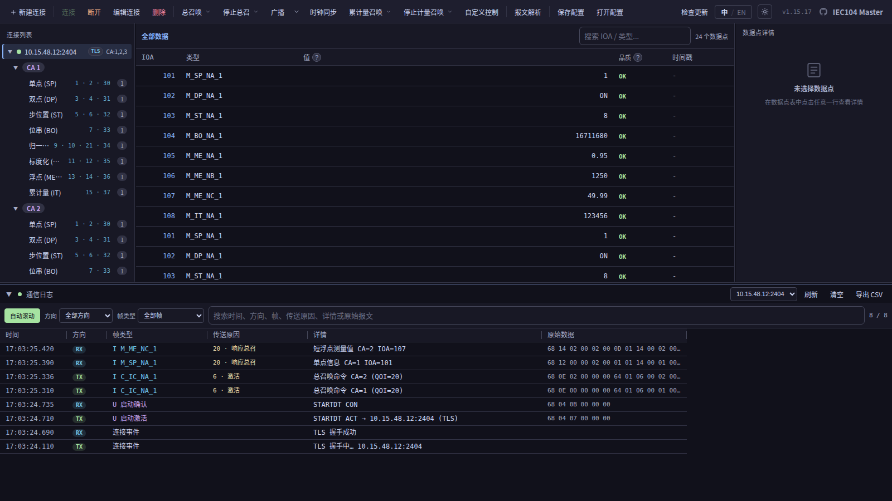
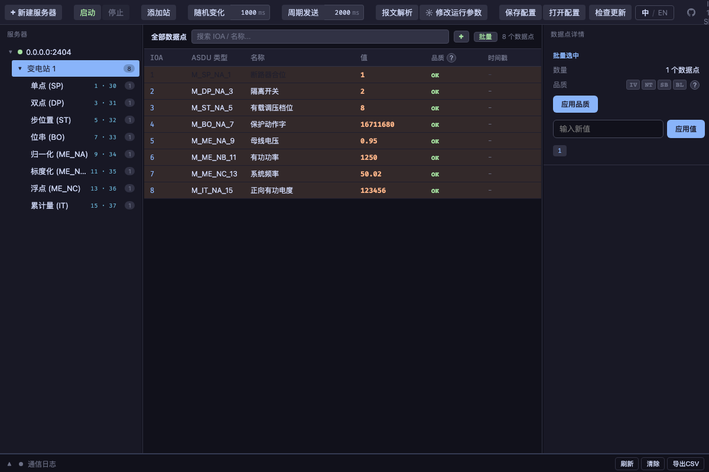
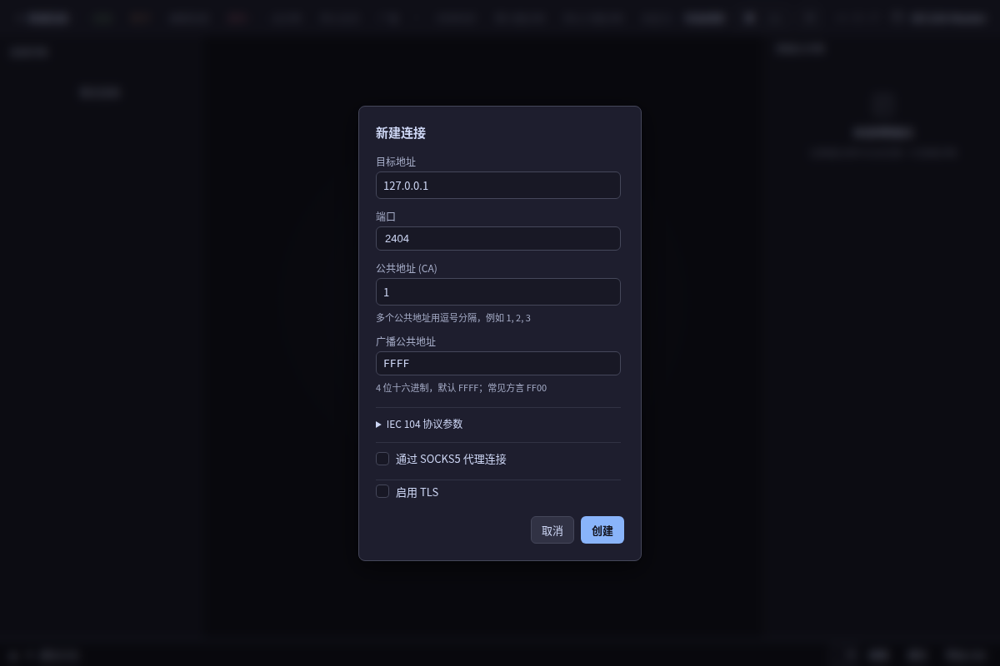
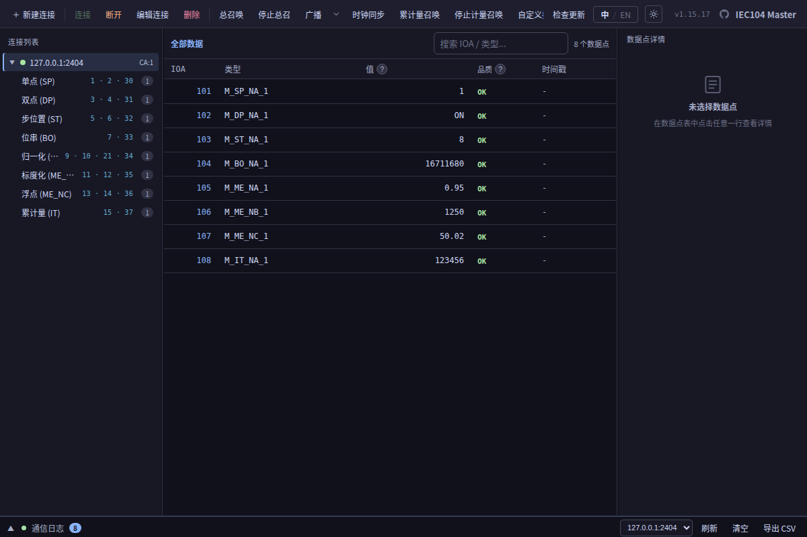
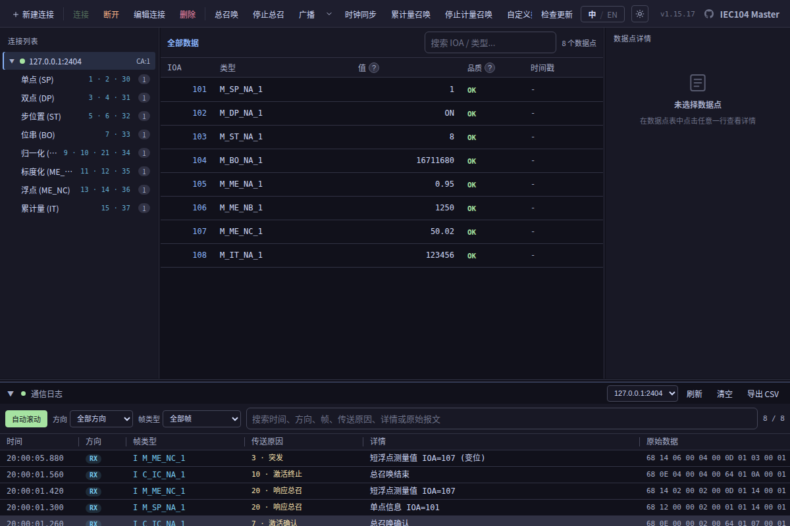

<div align="center">

# ⚡ IEC 60870-5-104 Simulator

**跨平台 IEC 60870-5-104 协议仿真工具 —— 从站与主站,一套桌面工具全包。**

[](https://github.com/Karl-Dai/IEC60870-5-104-Simulator/releases)
[](https://github.com/Karl-Dai/IEC60870-5-104-Simulator/releases)
[](https://github.com/Karl-Dai/IEC60870-5-104-Simulator/stargazers)
[](LICENSE)
[]()

基于 **Rust** · **Tauri 2** · **Vue 3** 构建

[English](README.md) · **中文**



</div>

---

## 项目简介

测试 IEC 104 集成往往需要借一台真实 RTU 或主站设备。本项目把**通信两端都搬到你的桌面**:

- 🛰️ **从站与主站同仓** —— 模拟一台变电站设备,或去驱动一台,无需任何外部硬件。
- 🔌 **协议覆盖完整** —— 8 大类监视数据(含 CP24/CP56 时标变体)、全部控制命令、总召/累计量召唤/时钟同步,支持 **TCP 或双向 TLS**。
- 🎛️ **遥控点位一等公民** —— 命令/设定值点(Type 45–51 / 58–64)可像监视点一样声明,跨 CA/IOA 映射到监视点,支持逐点限定词与选择后执行(SBO)。
- 🌐 **单链路多公共地址** —— 一条 TCP 连接同时与多个 Common Address 对话,各站数据互不串扰。
- 🖥️ **原生桌面应用** —— Rust + Tauri 的小体积安装包,覆盖 Windows / macOS / Linux,内置自动更新。
- 🌏 **中英双语界面** —— 完整 English / 简体中文,运行时即时切换。

## 目录

- [应用截图](#应用截图)
- [功能特性](#功能特性)
- [下载安装](#下载安装)
- [从源码构建](#从源码构建)
- [快速开始(教程)](#快速开始教程)
- [协议支持](#协议支持)
- [项目结构](#项目结构)
- [参与贡献](#参与贡献)
- [更新日志](#更新日志)
- [macOS 首次启动](#macos-首次启动)
- [许可证](#许可证)

## 应用截图

**主站 · 一条 TCP 链路上跑多个公共地址**

一个 IEC 104 主站连接可以同时与多个站(Common Address)对话。在"新建连接"对话框里把公共地址填成 `1, 2, 3`,连接树会自动展开为 **连接 → CA 徽章 → 分类** 三层结构,每个 CA 的分类计数独立统计 —— 不同站共用同一个 IOA 也不会在界面上互相覆盖。


**主站 · 支持可选认证与远程 DNS 的 SOCKS5 代理**

目标站无法直连时,可在**新建连接**对话框中让 IEC 104 连接通过 SOCKS5 代理建立。代理地址和端口必填,用户名/密码认证可选;还可让代理端解析目标域名,避免在本机发起 DNS 查询。



**主站 · 含 TLS 握手与多 CA 总召的通信日志**

底部通信日志面板完整记录每一步 TLS 握手、U/I/S 帧、传送原因解码、原始 hex 字节。截图里主站依次发送 **GI CA=1** 和 **GI CA=2**,并接收两个站各自的响应数据流。



## 功能特性

### 🛰️ 从站 —— `IEC104Slave`

- **IEC 104 服务端**,支持 TCP 和 TLS 连接
- **8 种数据类型** —— 单点、双点、步位置、位串、归一化、标度化、短浮点、累计量;监视方向含 CP24(短时标)与 CP56(全时标)变体
- **数据点管理** —— 单个或批量添加,批量支持 IOA 范围与非连续表达式(如 `6001, 6003, 6010-6050`);编辑对话框可直接改址(IOA),多选可批量设置控制点 QU/QL 与 S/E
- **按 IOA 表达式批量写值** —— 文本输入非连续/区间混合的 IOA(如 `100, 1000-2000, 5000`),选类型后给所有命中点写同一个值;实时显示「命中 N · 忽略 M」预览,免去在上万行里 Ctrl 逐个点选
- **点位周期变位** —— 数据表里右键任意(多)点位即可启停,行内脉冲指示;模拟量与累计量按三角波递增/递减(设步长与上下限,到边界自动掉头),离散量翻转;多点并发独立运行
- **随机变位** 与 **周期发送** —— 按可配置间隔模拟数据变化 / 周期性传送
- **自发传送**(COT=3)—— 数据变化后自动向已连接主站上送
- **总召唤**(GI)和**累计量召唤**响应
- **控制命令处理** —— 单点、双点、步调节、设定值、位串命令(Type 45–51 及时标变体 58–64),未知 IOA/类型、限定词不符、SBO 违规均按规约回否定确认
- **遥控点位一等公民** —— 控制方向点位可声明、可编辑,跨 CA/IOA 映射到监视点,逐点设置 QOC/QL 限定词与 S/E 执行模式(直接执行 / 选择后执行);旧版同 CA+IOA 自动写回保留为兼容开关(默认开启)
- **停止态可改监听地址/端口** —— 无需删除重建,直接修改已停止服务器的绑定地址/端口
- **通信日志** —— 支持 hex 帧显示、面板高度可拖拽、CSV 导出
- 创建服务器后自动启动

### 📡 主站 —— `IEC104Master`

- **IEC 104 客户端**,支持 TCP 和 TLS 连接
- **逐连接 SOCKS5 代理** —— 在新建连接对话框中配置代理地址/端口、可选用户名/密码认证,并选择本地或代理端 DNS 解析
- **一个连接绑定多个公共地址 (CA)** —— 单条 TCP 链路上同时与多个站对话;连接成功后自动 GI / 时钟同步 / 累计量召唤按 CA 列表逐一发送;接收侧按 CA 分桶存储,不同站的同 IOA 不互相覆盖
- **多 CA 三层连接树** —— 连接 → CA 徽章 → 分类,每个 CA 的分类计数独立;单 CA 连接保持原扁平树
- **实时数据显示** —— 增量轮询 + 虚拟滚动
- **分类树** —— 实时显示各类别点数(单点、双点、步位置、位串、归一化、标度化、浮点、累计量)
- **自定义控制对话框** —— CA 字段下拉选当前连接已配置的 CAs,IOA 任意输;发送成功后窗口保留以便连续发命令;CA / IOA / 命令类型 / 值字段持久化到 localStorage,跨打开和重启都记得
- **控制命令** —— 直接执行和选择-执行(SbO);右键控制命令直接路由到数据点自身的 CA(多 CA 场景下不会发错站)
- **值面板** —— 显示选中数据点详情
- **总召唤**、**累计量召唤**、**时钟同步**命令 —— 多 CA 连接下总召与累计量召唤可按 CA 选择(指定某个 CA 或「全部 CA」)
- **停止激活(COT=8)** —— 可对进行中的总召唤 / 累计量召唤下发停止激活(按 CA、「全部 CA」并发,或广播),从站回「停止确认」(COT=9)
- **掉线自动重连** —— T0 限制单次连接建立时长；独立的 **Channel Retry**（默认 5 秒）控制下一次尝试前的固定等待，不设次数上限，也不做指数退避
- **通信日志** —— 含 TLS 握手事件、U/I/S 帧解码、COT 中文化、原始 hex 字节并排显示;支持 CSV 导出
- **应用内自动更新** —— 从 GitHub Releases 推送(ed25519 签名验证、6 小时检查节流、"稍后" 24 小时不重提)

## 下载安装

各平台预编译安装包均在 **[Releases 页面](https://github.com/Karl-Dai/IEC60870-5-104-Simulator/releases)**。

| 平台 | 安装包 |
|------|--------|
| Windows | `.msi` / `.exe`(NSIS) |
| macOS   | `.dmg`(Apple Silicon 与 Intel) |
| Linux   | `.AppImage` / `.deb` |

两个应用自 v1.0.9 起均支持从 GitHub Releases **自动更新**。macOS 用户首次启动需要[多做一步](#macos-首次启动)。

### 国内镜像 (China mirror)

中国大陆用户访问 GitHub Releases 可能不稳定,推荐通过镜像直接下载安装包:

- <https://ghfast.top/https://github.com/Karl-Dai/IEC60870-5-104-Simulator/releases/latest>

自 v1.12.10 起,应用内更新会**优先**走自建大陆加速源(`gh.carldai.cloud`,腾讯云节点,链式回源新加坡反代取 GitHub,并把安装包下载也中继到大陆前端),再回退到 GitHub 源站 —— 无需手动处理。但**首次从旧版升级**时,旧版二进制里编译进的 endpoint 仍是 github.com,如果检查更新失败,请按上面镜像链接手动下载新版安装一次,之后更新即可自动经自建镜像路由。

## 从源码构建

### 环境要求

- [Rust](https://rustup.rs/) 1.77+
- [Node.js](https://nodejs.org/) 18+
- [Tauri CLI](https://tauri.app/) —— `cargo install tauri-cli`

### 步骤

```bash
# 安装前端依赖
cd frontend && npm install
cd ../master-frontend && npm install

# 启动从站
cd crates/iec104sim-app && cargo tauri dev

# 启动主站
cd crates/iec104master-app && cargo tauri dev

# 仅启动主站浏览器 mock（用于前端 E2E/视觉检查，不覆盖 Rust/Tauri 联动）
cd ../../master-frontend && npm run dev:mock
```

## 快速开始(教程)

一次完整往返跑通 —— 用主站驱动仿真从站,全程无需硬件。(截图为中文界面,随时可用 **中 / EN** 切换语言。)

> **先装好:** 在 [Releases 页面](#下载安装)下载你平台对应的安装包,或从源码运行(`cargo tauri dev`)。把 **IEC104Slave** 与 **IEC104Master** 都打开。

### 第 1 步 · 从站 —— 新建服务器并配置数据点

打开 **IEC104Slave**,点击 **新建服务器**:自动绑定 `0.0.0.0:2404` 并启动。添加一个站,再批量添加覆盖全部 8 种监视类型的数据点 —— 单点 / 双点 / 步位置 / 位串 / 归一化 / 标度化 / 短浮点 / 累计量。每个点都带 IOA、值和品质位。



**小贴士 · 批量添加**:**批量添加** 对话框填 IOA 范围(如 `1-200`)与 ASDU 类型,一次即可创建上百个点。

### 第 2 步 · 主站 —— 新建连接

打开 **IEC104Master**,点击 **新建连接**。默认值已指向本地从站:目标地址 `127.0.0.1`、端口 `2404`、公共地址 `1`。

- **单链路多 CA** —— 一条 TCP 连接要同时对接多个站时,把公共地址用逗号分隔填成 `1, 2, 3`;连接树会展开为 **连接 → CA 徽章 → 分类**,每个 CA 的点数独立统计,不同站共用同一个 IOA 也不会在界面上互相覆盖。
- **TLS** —— 勾选 **启用 TLS**,提供 CA / 客户端证书 / 密钥路径即可用双向 TLS(Windows「复制为路径」带引号的路径会自动去掉引号)。

点 **创建**,再点 **连接**。



### 第 3 步 · 总召唤,数据表填满

点击 **总召唤**。多 CA 连接会弹出菜单让你选某个 CA 或 **全部 CA**,单 CA 连接则直接发送。从站回送全部数据点;连接树显示各分类计数,表格填满接收到的 IOA、值与品质。归一化测量值显示为原始 NVA 整数(i16),与报文字节一一对应。



**累计量召唤** 与 **时钟同步** 就在总召旁边 —— 多 CA 连接下累计量召唤同样可按 CA 选择。

### 第 4 步 · 从主站下发控制命令

打开 **控制**(或右键某个数据点 → **控制** —— 此方式直接路由到该点自身的源 CA,多 CA 场景下不会发错站)。**自定义控制对话框** 可:

- 从当前连接已配置的 CAs 里下拉选 **CA**;
- 任意输入 **IOA** 与值;
- 选择 **命令类型**(单点 / 双点 / 步调节 / 设定值 / 位串);
- 选择 **控制模式** —— **直接执行**、**仅选择** 或 **自动 SbO**(选择-执行,下次打开仍记得)。

发送成功后窗口保留,方便连续下发;CA / IOA / 类型 / 值 / 模式跨打开与重启都会记住。

### 第 5 步 · 变位并观察自发上送

回到从站,改值并看主站实时刷新:

- **右键 → 周期变位** 给任意(多)点 —— 模拟量与累计量按**三角波**递增/递减(设步长与上下限,到边界自动掉头,行内图标显示 ↑/↓/⇅),离散量翻转;多点并发且彼此独立。
- 工具栏上的 **写值(按 IOA)** —— 文本里混合单个 IOA 与区间(如 `100, 1000-2000, 5000`),选类型,给所有命中点写同一个值,实时显示「命中 N · 忽略 M」预览。
- 变化的值以**自发(COT=3)**上送,实时出现在主站表格与日志里。若主站链路断开,会持续**自动重连**：T0 限制每次连接尝试，**Channel Retry** 控制两次尝试之间的固定间隔（0 表示立即重试）。

### 第 6 步 · 看报文 —— 帧解码与原始 hex

展开底部 **通信日志**(可拖拽分隔条改高度,高度会被记住)。每一帧 U/I/S 都被解码 —— 帧类型、传送原因(COT)、可读详情与原始 hex 并排显示。主站的**自动重连**、TLS 握手步骤、**TESTFR** 心跳都会记录在内。点 **导出 CSV** 可把整份日志导出做离线分析。

日志说明和校验消息会跟随界面语言本地化；`Type ID`、`COT`、`CA`、`IOA`、`QOI`、`QCC`、`S/E`、`QU/QL`、APDU 十六进制、证书路径、IP 地址和系统错误码等协议/技术字段刻意保留标准原文。



至此一次完整往返跑通 —— 服务器、点位、总召、控制、变位、报文级检查,全在桌面上完成。

## 协议支持

| 功能 | 支持类型 |
|------|---------|
| 监视方向(从站→主站) | M_SP_NA/TB, M_DP_NA/TB, M_ST_NA/TB, M_BO_NA/TB, M_ME_NA/TD, M_ME_NB/TE, M_ME_NC/TF, M_IT_NA/TB |
| 控制方向(主站→从站) | C_SC_NA, C_DC_NA, C_RC_NA, C_SE_NA/NB/NC |
| 系统命令 | C_IC_NA(总召唤)、C_CI_NA(累计量召唤)、C_CS_NA(时钟同步) |
| 传输原因 | 突发(3)、激活(6)、激活确认(7)、停止激活(8)、停止确认(9)、激活终止(10)、总召唤(20)、累计量召唤(37) |
| 传输层 | TCP、TLS(支持双向 TLS) |

## 项目结构

```
IEC104Sim/
├── crates/
│   ├── iec104sim-core/     # IEC 104 协议核心库
│   ├── iec104sim-app/      # 从站 Tauri 应用
│   └── iec104master-app/   # 主站 Tauri 应用
├── frontend/               # 从站 Vue 3 前端
├── master-frontend/        # 主站 Vue 3 前端
└── shared-frontend/        # 共享 Vue 组件、i18n、样式
```

| 层 | 技术栈 |
|----|--------|
| 后端 | Rust、Tokio(异步运行时)、native-tls |
| 前端 | Vue 3、TypeScript、Vite |
| 桌面端 | Tauri 2 |

## 参与贡献

欢迎提交 Issue 与 Pull Request。提交代码改动前,请确保 `cargo test --workspace` 与前端 `npm test` 测试套件全部通过。

## 更新日志

最新变更请参见 [CHANGELOG.md](CHANGELOG.md) 或 [Releases 页面](https://github.com/Karl-Dai/IEC60870-5-104-Simulator/releases)。

从 v1.0.9 起,两个应用在启动时自动检测 GitHub Releases,发现新版本会弹窗提示安装。v1.0.8 及更早版本的用户需要手动升级一次。

## macOS 首次启动

应用未做 Apple 公证(Notarization)。首次双击 `.app` 时,macOS 会弹窗 *"未打开 IEC104Slave / IEC104Master —— Apple 无法验证…"*,只提供 *完成* 与 *移到废纸篓* 两个按钮。这是 macOS 15 (Sequoia) 起对 ad-hoc 签名应用的标准拦截,**不是软件损坏**。

<details>
<summary><b>放行步骤(任选其一)</b></summary>

**1. 图形界面**

- 双击 `.app`,出现拦截弹窗,点 *完成*。
- 打开 *系统设置 → 隐私与安全性*,滚到底部。
- 看到 *"已阻止 IEC104Slave 的使用…"*,点 *仍要打开* 并输入密码。
- 弹窗变为 *打开*,点击即可,以后双击直接启动。

**2. 终端一行命令**

```bash
xattr -dr com.apple.quarantine "/Applications/IEC104Slave.app"
xattr -dr com.apple.quarantine "/Applications/IEC104Master.app"
```

清掉隔离标记,macOS 不再拦截。

如果你看到 *"已损坏,无法打开"* 而不是上面的对话框,那是 v1.1.1 及更早完全无签名的旧版,请升级到 v1.1.2 以上(应用内"检查更新"也会推过来),或用上面的 `xattr` 命令清掉隔离属性。

</details>

## 许可证

[MIT](LICENSE)
