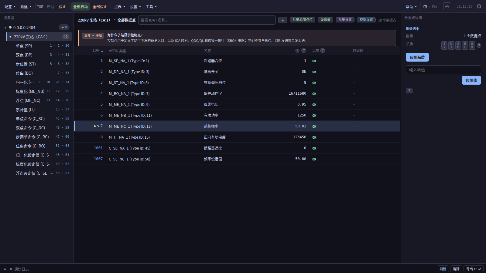
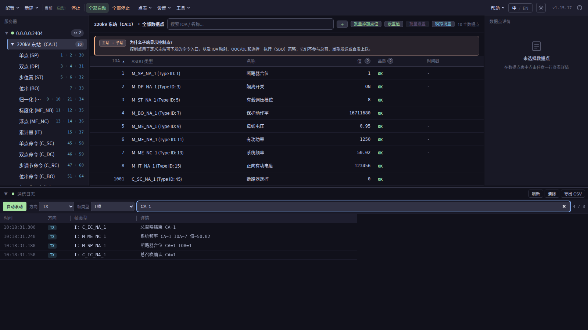
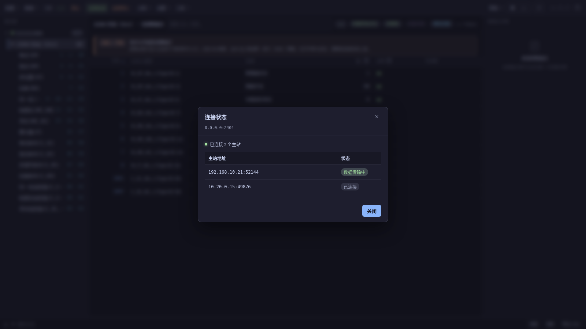
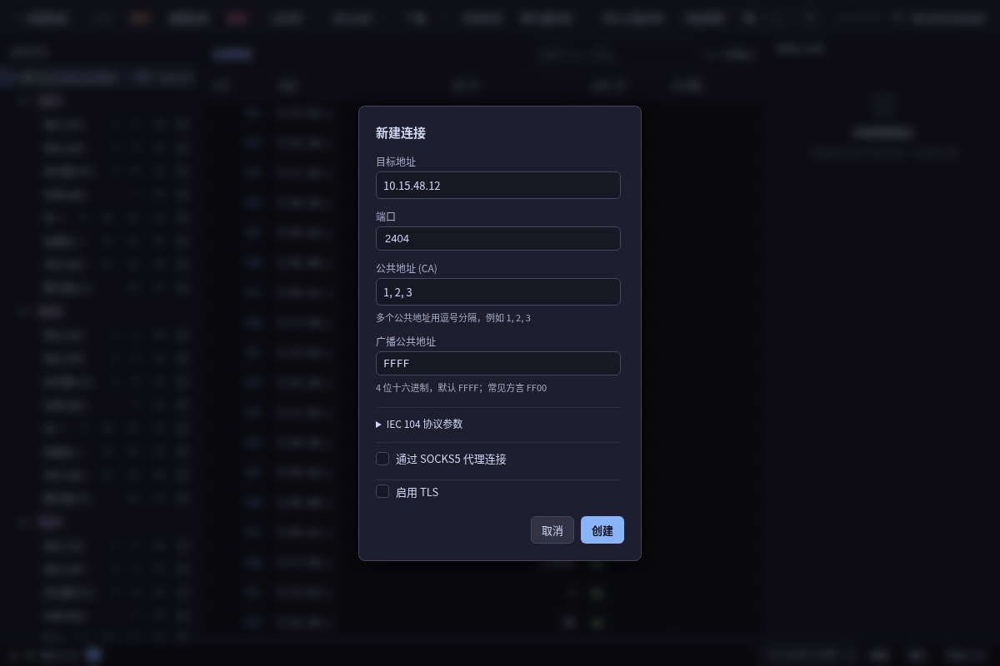
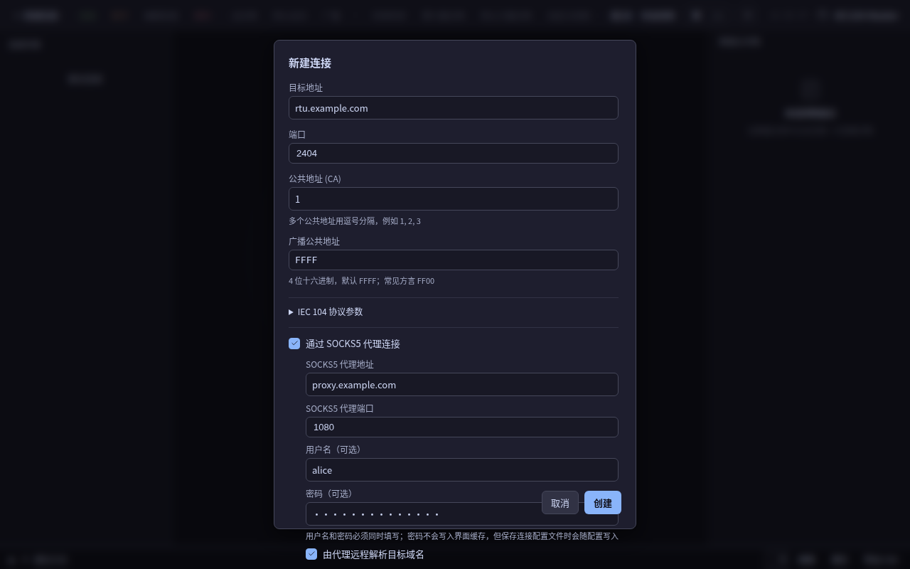
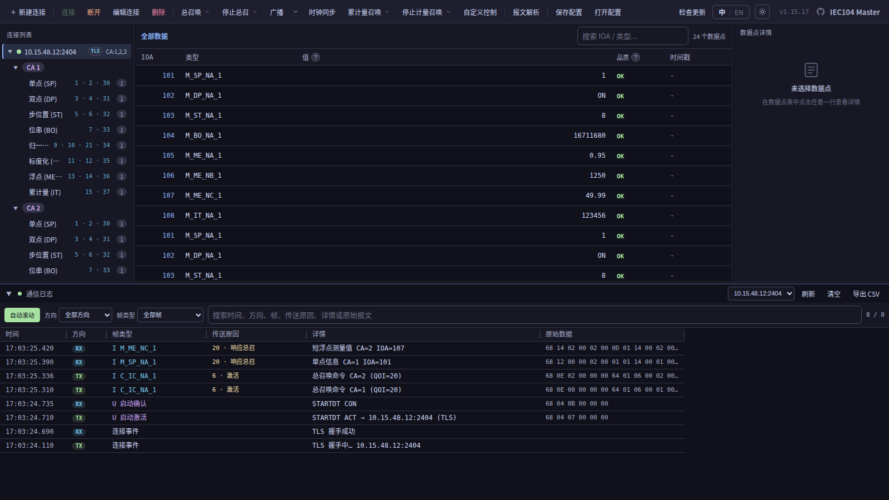
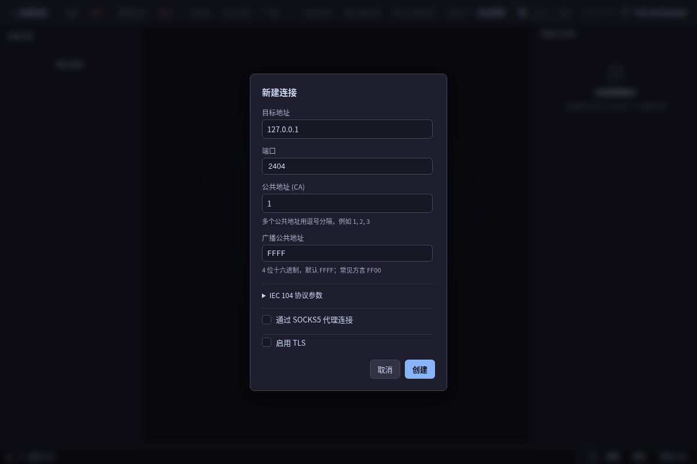
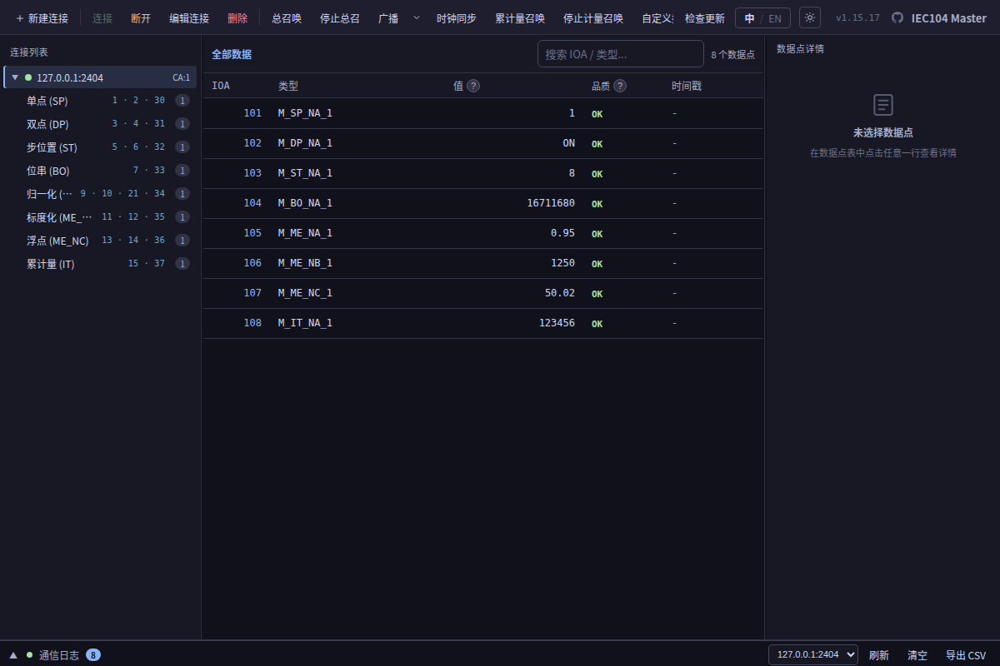
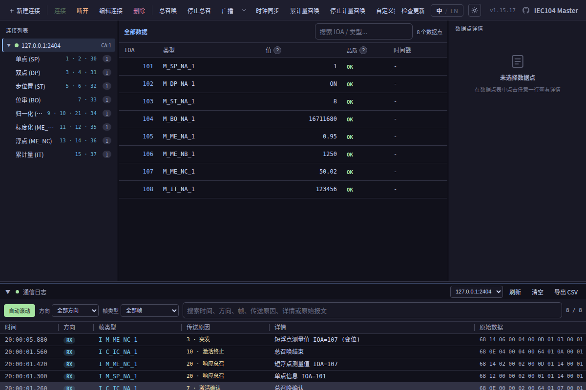

<div align="center">

# ⚡ IEC 60870-5-104 Simulator

**跨平台 IEC 60870-5-104 协议仿真工具 —— 从站与主站,一套桌面工具全包。**

### 🌐 [在线体验 SimLab — simlab.carldai.cloud](https://simlab.carldai.cloud)

[](https://github.com/Karl-Dai/IEC60870-5-104-Simulator/releases)
[](https://github.com/Karl-Dai/IEC60870-5-104-Simulator/releases)
[](https://github.com/Karl-Dai/IEC60870-5-104-Simulator/stargazers)
[](LICENSE)


基于 **Rust** · **Tauri 2** · **Vue 3** 构建

[English](README.md) · **中文**

<picture>
  <source srcset="docs/screenshots/iec104-simulator-demo.webp" type="image/webp">
  
</picture>
<br>
<sub>从站点表 → 报文分析 → 随机仿真 → 主站多 CA</sub>

</div>

---

## 项目简介

测试 IEC 104 集成往往需要借一台真实 RTU 或主站设备。本项目把**通信两端都搬到你的桌面**:

- 🛰️ **从站与主站同仓** —— 模拟一台变电站设备,或去驱动一台,无需任何外部硬件。
- 🔌 **常用协议操作** —— 8 大类监视数据(含已实现的 CP24/CP56 时标变体)、控制/设定值/位串命令、总召/累计量召唤/时钟同步,支持 **TCP 或双向 TLS**。
- 🎛️ **遥控点位一等公民** —— 命令/设定值点(Type 45–51 / 58–64)可像监视点一样声明,跨 CA/IOA 映射到监视点,支持逐点限定词与选择后执行(SBO)。
- 🌐 **单链路多公共地址** —— 一条 TCP 连接同时与多个 Common Address 对话,各站数据互不串扰。
- 🖥️ **原生桌面应用** —— Rust + Tauri 的小体积安装包,覆盖 Windows / macOS / Linux,内置自动更新。
- 🌏 **中英双语界面** —— 完整 English / 简体中文,运行时即时切换。

## 目录

- [应用截图](#应用截图)
- [功能特性](#功能特性)
- [工作区保存与恢复](#工作区保存与恢复)
- [TLS 与证书](#tls-与证书)
- [下载安装](#下载安装)
- [从源码构建](#从源码构建)
- [快速开始(教程)](#快速开始教程)
- [协议支持](#协议支持)
- [项目结构](#项目结构)
- [参与贡献](#参与贡献)
- [更新日志](#更新日志)
- [macOS 首次启动](#macos-首次启动)
- [许可证](#许可证)

## 应用截图

以下为早期版本的示意截图,菜单位置和版本标识可能不同;操作请以本文教程中的当前菜单路径为准。

**从站 · CSV 点表与可搜索报文日志**

点表文件操作位于**点表 → 导入 CSV / 导出 CSV / 下载模板**。展开通信日志后,可按方向、帧类型或 Type ID 筛选,搜索解析详情和原始报文,查看当前/总条数,并导出当前筛选结果。



**从站 · 实时查看主站连接**

每个从站服务器节点都会实时显示已连接主站数量。点击数量徽标,或在服务器右键菜单选择**查看主站连接**,即可查看各主站的 IP/端口,以及 IEC 104 数据传输是否已通过 STARTDT 激活。主站接入、激活传输或断开时,数量和详情列表都会自动刷新。



**从站 · 有界随机仿真**

选中任意数值型点位后打开**模拟设置**,即可用**随机**模式在设定范围内周期取值。抽屉会显示所选 IOA 与 Type ID、周期、下限/上限、当前值以及全部活动模拟;点表行内同步显示当前模拟方式。

**主站 · 一条 TCP 链路上跑多个公共地址**

一个 IEC 104 主站连接可以同时与多个站(Common Address)对话。在"新建连接"对话框里把公共地址填成 `1, 2, 3`,连接树会自动展开为 **连接 → CA 徽章 → 分类** 三层结构,每个 CA 的分类计数独立统计 —— 不同站共用同一个 IOA 也不会在界面上互相覆盖。



**主站 · 支持可选认证与远程 DNS 的 SOCKS5 代理**

目标站无法直连时,可在**新建连接**对话框中让 IEC 104 连接通过 SOCKS5 代理建立。代理地址和端口必填,用户名/密码认证可选;还可让代理端解析目标域名,避免在本机发起 DNS 查询。



**主站 · 含 TLS 握手与多 CA 总召的通信日志**

底部通信日志面板完整记录每一步 TLS 握手、U/I/S 帧、传送原因解码、原始 hex 字节。截图里主站依次发送 **GI CA=1** 和 **GI CA=2**,并接收两个站各自的总召响应数据(COT=20)。



## 功能特性

两个应用均支持明暗主题(初始跟随系统,手动选择后记忆)、运行时中英切换、本机工作区恢复与签名应用内更新。

### 🛰️ 从站 —— `IEC104Slave`

- **IEC 104 服务端**,支持 TCP 和 TLS 连接
- **8 种数据类型** —— 单点、双点、步位置、位串、归一化、标度化、短浮点、累计量;监视方向含 CP24(短时标)与 CP56(全时标)变体
- **数据点管理** —— 单个或批量添加,批量支持 IOA 范围与非连续表达式(如 `6001, 6003, 6010-6050`);编辑对话框可直接改址(IOA),多选可批量设置控制点 QU/QL 与 S/E
- **CSV 点表闭环** —— 下载字段模板,导出子站完整点表配置,服务器停止时再以「合并」或「替换」方式导入;校验错误精确到行和字段,点位的周期变位配置也会一并往返
- **事件 JSON 回放** —— 按相对毫秒设置点位值并发送 COT=3;同一毫秒的同类型事件使用 SQ=0 合帧,支持同一 IOA 在一帧内连续发送不同值
- **按 IOA 表达式批量写值** —— 文本输入非连续/区间混合的 IOA(如 `100, 1000-2000, 5000`),选类型后给所有命中点写同一个值;实时显示「命中 N · 忽略 M」预览,免去在上万行里 Ctrl 逐个点选
- **点位周期变位** —— 数据表里右键任意(多)点位即可启停,行内脉冲指示;模拟量与累计量按三角波递增/递减(设步长与上下限,到边界自动掉头),离散量翻转;多点并发独立运行
- **随机变位** 与 **周期发送** —— 按可配置间隔模拟数据变化 / 周期性传送
- **自发传送**(COT=3)—— 数据变化后自动向已连接主站上送
- **实时查看主站连接** —— 每个子站服务器显示当前主站连接数;点击数量徽标或服务器右键菜单,可查看主站 IP/端口及 IEC 104 数据传输(STARTDT)是否激活,列表自动刷新
- **总召唤**(GI)和**累计量召唤**响应
- **控制命令处理** —— 单点、双点、步调节、设定值、位串命令(Type 45–51 及时标变体 58–64),未知 IOA/类型、限定词不符、SBO 违规均按规约回否定确认
- **遥控点位一等公民** —— 控制方向点位可声明、可编辑,跨 CA/IOA 映射到监视点,逐点设置 QOC/QL 限定词与 S/E 执行模式(直接执行 / 选择后执行);旧版同 CA+IOA 自动写回保留为兼容开关(默认开启)
- **停止态可改监听地址/端口** —— 无需删除重建,直接修改已停止服务器的绑定地址/端口
- **通信日志分析** —— 按 RX/TX、I/S/U 帧或具体 Type ID 筛选,搜索解析详情和原始字节,调整列宽与面板高,自动跟随实时报文,并将全部或当前筛选结果导出 CSV
- **批量操作** —— 全部启动/停止服务器,批量删除服务器/站点/点位,批量修改点位类型和控制选项
- **模拟上送节流** —— 按服务器设置点位更新批量数和延迟,每条主站连接独立节流,协议响应可继续发送
- 创建服务器后自动启动

### 事件 JSON 格式

在“点表”菜单选择“导入事件 JSON”。服务器必须正在运行,并且至少有一个主站已完成 STARTDT。`time_ms` 从确认启动的时刻开始计算。

```json
[
  { "time_ms": 1000, "type": "M_SP_TB_1", "ioa": 1001, "value": false },
  { "time_ms": 1000, "type": "M_SP_TB_1", "ioa": 1001, "value": true }
]
```

简单值直接写布尔值或数字。步位置使用 `{"value":-1,"transient":false}`。累计量使用 `{"value":123,"carry":false,"sequence":0}`。

归一化测量值填写线上原始 NVA 整数,范围为 `-32768..32767`。文件最大 20 MiB、最多 100,000 条事件,最长 7 天。程序会先校验全部记录,任何错误都会取消整次回放。“下载事件 JSON 示例”会按当前站已有点位生成可编辑文件。

事件类型不要求与点表精确一致:同一 IOA 下存在同类型或同数据类别(单点/双点/测量量等,同类别内优先不带时标的变体)的点位即可通过校验,值会写入这个实际点位;但上送给主站的报文仍使用文件中声明的类型。

### 📡 主站 —— `IEC104Master`

- **IEC 104 客户端**,支持 TCP 和 TLS 连接
- **逐连接 SOCKS5 代理** —— 在新建连接对话框中配置代理地址/端口、可选用户名/密码认证,并选择本地或代理端 DNS 解析
- **一个连接绑定多个公共地址 (CA)** —— 单条 TCP 链路上同时与多个站对话;通过「召唤 → 总召唤 / 累计量召唤」明确选择 CA(或全部 CA),时钟同步发送至配置的 CA 列表;连接成功不会自动发送总召;接收侧按 CA 分桶存储,不同站的同 IOA 不互相覆盖
- **多 CA 三层连接树** —— 连接 → CA 徽章 → 分类,每个 CA 的分类计数独立;单 CA 连接保持原扁平树
- **实时数据显示** —— 增量轮询 + 虚拟滚动
- **分类树** —— 实时显示各类别点数(单点、双点、步位置、位串、归一化、标度化、浮点、累计量)
- **自定义控制对话框** —— CA 字段下拉选当前连接已配置的 CAs,IOA 任意输;发送成功后窗口保留以便连续发命令;CA / IOA / 命令类型 / 值字段持久化到 localStorage,跨打开和重启都记得
- **控制命令(45–51)** —— 直接执行和选择-执行(SbO,位串仅执行);右键控制命令直接路由到数据点自身的 CA(多 CA 场景下不会发错站)
- **值面板** —— 显示选中数据点详情
- **总召唤**、**累计量召唤**、**时钟同步**命令 —— 单 CA 连接也需明确选择总召与累计量召唤的 CA(指定某个 CA 或「全部 CA」)
- **停止激活(COT=8)** —— 可对总召唤 / 累计量召唤下发停止激活请求(按 CA、「全部 CA」并发,或广播),从站回「停止确认」(COT=9)
- **掉线自动重连** —— T0 限制单次连接建立时长；独立的 **Channel Retry**（默认 5 秒）控制下一次尝试前的固定等待，不设次数上限，也不做指数退避
- **通信日志分析** —— TLS 握手事件、U/I/S 帧与 COT 解码、原始 hex 字节显示,支持 RX/TX、帧类型 / Type ID 筛选、全文搜索、可调列宽、自动跟随与筛选结果 CSV 导出
- **应用内自动更新** —— 从 GitHub Releases 推送(ed25519 签名验证、6 小时检查节流、"稍后" 24 小时不重提)

### 工作区保存与恢复

两个应用都会在配置变更后自动将工作区定义保存到本机,启动时恢复。从站恢复服务器、站点、点位定义、TLS 及协议/远程操作设置。主站恢复连接定义(含 CA、TLS、SOCKS5 设置);**自动保存不包含已接收的实时点表**。通过**配置 → 保存配置**显式导出 JSON:主站手动保存会包含已接收点位快照,可供离线查看。

**配置 → 打开配置**会用选定 JSON 替换当前工作区。恢复/导入后,从站服务器处于**停止**状态,主站连接处于**断开**状态,需要手动启动/连接。保存的主站快照属于历史数据,并不表示连接正在运行。证书文件通过路径引用,在目标计算机上仍需可访问。

导出配置和本机工作区存储可能包含**明文 SOCKS5 密码**、现场地址和证书路径。分享前删除凭据与敏感现场信息;不要公开这些文件或提交私钥。

### TLS 与证书

从站需要 PEM 服务端证书及匹配的私钥。双向 TLS 还需启用**要求客户端证书**并提供客户端 CA;主站启用 TLS 后提供服务端 CA,在对端要求时提供客户端证书/密钥。Windows 粘贴路径的包裹引号会被规范化。X.509 v1/v3 是证书格式,与 TLS 1.2/1.3 相互独立。

- **从站:**rustls 处理 TLS;兼容验证器通过 OpenSSL 支持旧 X.509 v1 证书,包括 v1/v3 混合双向 TLS。v1 客户端必须链至配置的 CA、处于有效期并证明持有私钥;弱密钥/签名会被拒绝。v1 缺少 SAN/密钥用途扩展,新签证书优先用 v3。PEM 文件不会被改写,从站私钥不会导入 macOS Keychain。
- **主站:**配置自定义 CA 且没有 PKCS#12 身份时走 vendored OpenSSL;单向 TLS 可不提供 PEM 客户端证书/密钥,对端要求双向 TLS 时必须提供。默认保留 CA/有效期/用途/签名检查,并同时信任系统根证书与自定义 CA。未配置自定义 CA,或核心库使用 PKCS#12 身份的连接,走 native-tls 并受平台限制。桌面连接对话框提供 PEM 路径字段。
- 即使启用证书校验,主站目前也不检查设备证书的主机名匹配。**接受无效证书**还会关闭信任校验;检查对端信任时应保持关闭。支持 TLS 不代表完整符合 IEC 62351。

如需用实际核心库主站和从站检查已有证书目录,从仓库根目录运行:

```bash
IEC104_TLS_CERT_DIR=/path/to/certs cargo test -p iec104sim-core --lib tls_compat::tests::configured_certificate_directory -- --ignored
```

目录必须包含 `ca.crt`、`server.crt`、`server.key`、`client.crt`、`client.key`。测试使用回环地址,检查双向 TLS 1.2/1.3、交换 STARTDT/TESTFR 并接收总召数据,不会修改证书文件。不要把私钥或现场证书提交为测试样例。

## 下载安装

教程需要安装**主站与从站两个应用**。下表文件名对应 [v1.15.21 实际发行资产](https://github.com/Karl-Dai/IEC60870-5-104-Simulator/releases/tag/v1.15.21);新版本请查看 [Releases](https://github.com/Karl-Dai/IEC60870-5-104-Simulator/releases)。

| 平台 / 格式 | 从站 Slave | 主站 Master |
|---|---|---|
| macOS Apple Silicon | [IEC104Slave_1.15.21_aarch64.dmg](https://github.com/Karl-Dai/IEC60870-5-104-Simulator/releases/download/v1.15.21/IEC104Slave_1.15.21_aarch64.dmg) | [IEC104Master_1.15.21_aarch64.dmg](https://github.com/Karl-Dai/IEC60870-5-104-Simulator/releases/download/v1.15.21/IEC104Master_1.15.21_aarch64.dmg) |
| macOS Intel | [IEC104Slave_1.15.21_x64.dmg](https://github.com/Karl-Dai/IEC60870-5-104-Simulator/releases/download/v1.15.21/IEC104Slave_1.15.21_x64.dmg) | [IEC104Master_1.15.21_x64.dmg](https://github.com/Karl-Dai/IEC60870-5-104-Simulator/releases/download/v1.15.21/IEC104Master_1.15.21_x64.dmg) |
| Windows x64 · NSIS | [IEC104Slave_1.15.21_x64-setup.exe](https://github.com/Karl-Dai/IEC60870-5-104-Simulator/releases/download/v1.15.21/IEC104Slave_1.15.21_x64-setup.exe) | [IEC104Master_1.15.21_x64-setup.exe](https://github.com/Karl-Dai/IEC60870-5-104-Simulator/releases/download/v1.15.21/IEC104Master_1.15.21_x64-setup.exe) |
| Windows x64 · MSI | [IEC104Slave_1.15.21_x64_en-US.msi](https://github.com/Karl-Dai/IEC60870-5-104-Simulator/releases/download/v1.15.21/IEC104Slave_1.15.21_x64_en-US.msi) | [IEC104Master_1.15.21_x64_en-US.msi](https://github.com/Karl-Dai/IEC60870-5-104-Simulator/releases/download/v1.15.21/IEC104Master_1.15.21_x64_en-US.msi) |
| Windows x64 · Portable | [IEC104Slave_1.15.21_x64-portable.exe](https://github.com/Karl-Dai/IEC60870-5-104-Simulator/releases/download/v1.15.21/IEC104Slave_1.15.21_x64-portable.exe) | [IEC104Master_1.15.21_x64-portable.exe](https://github.com/Karl-Dai/IEC60870-5-104-Simulator/releases/download/v1.15.21/IEC104Master_1.15.21_x64-portable.exe) |
| Windows ARM64 · NSIS | [IEC104Slave_1.15.21_arm64-setup.exe](https://github.com/Karl-Dai/IEC60870-5-104-Simulator/releases/download/v1.15.21/IEC104Slave_1.15.21_arm64-setup.exe) | [IEC104Master_1.15.21_arm64-setup.exe](https://github.com/Karl-Dai/IEC60870-5-104-Simulator/releases/download/v1.15.21/IEC104Master_1.15.21_arm64-setup.exe) |
| Windows ARM64 · MSI | [IEC104Slave_1.15.21_arm64_en-US.msi](https://github.com/Karl-Dai/IEC60870-5-104-Simulator/releases/download/v1.15.21/IEC104Slave_1.15.21_arm64_en-US.msi) | [IEC104Master_1.15.21_arm64_en-US.msi](https://github.com/Karl-Dai/IEC60870-5-104-Simulator/releases/download/v1.15.21/IEC104Master_1.15.21_arm64_en-US.msi) |
| Windows ARM64 · Portable | [IEC104Slave_1.15.21_arm64-portable.exe](https://github.com/Karl-Dai/IEC60870-5-104-Simulator/releases/download/v1.15.21/IEC104Slave_1.15.21_arm64-portable.exe) | [IEC104Master_1.15.21_arm64-portable.exe](https://github.com/Karl-Dai/IEC60870-5-104-Simulator/releases/download/v1.15.21/IEC104Master_1.15.21_arm64-portable.exe) |
| Linux x64 · AppImage | [IEC104Slave_1.15.21_amd64.AppImage](https://github.com/Karl-Dai/IEC60870-5-104-Simulator/releases/download/v1.15.21/IEC104Slave_1.15.21_amd64.AppImage) | [IEC104Master_1.15.21_amd64.AppImage](https://github.com/Karl-Dai/IEC60870-5-104-Simulator/releases/download/v1.15.21/IEC104Master_1.15.21_amd64.AppImage) |
| Linux x64 · deb | [IEC104Slave_1.15.21_amd64.deb](https://github.com/Karl-Dai/IEC60870-5-104-Simulator/releases/download/v1.15.21/IEC104Slave_1.15.21_amd64.deb) | [IEC104Master_1.15.21_amd64.deb](https://github.com/Karl-Dai/IEC60870-5-104-Simulator/releases/download/v1.15.21/IEC104Master_1.15.21_amd64.deb) |
| Linux x64 · rpm | [IEC104Slave-1.15.21-1.x86_64.rpm](https://github.com/Karl-Dai/IEC60870-5-104-Simulator/releases/download/v1.15.21/IEC104Slave-1.15.21-1.x86_64.rpm) | [IEC104Master-1.15.21-1.x86_64.rpm](https://github.com/Karl-Dai/IEC60870-5-104-Simulator/releases/download/v1.15.21/IEC104Master-1.15.21-1.x86_64.rpm) |

Windows `-setup.exe` 与 `.msi` 是安装包;`-portable.exe` 可免安装运行,仍需要 WebView2。本版 Linux 资产仅为 x64;AppImage 可能需要 `chmod +x <file>.AppImage`。`.sig`、macOS `.app.tar.gz`、`latest-master*.json` / `latest-slave*.json` 分别是更新器签名、包和清单,不是手动安装选项。

两个应用自 v1.0.9 起均支持从 GitHub Releases **自动更新**。macOS 用户首次启动需要[多做一步](#macos-首次启动)。

### 国内镜像 (China mirror)

中国大陆用户访问 GitHub Releases 可能不稳定,推荐通过镜像直接下载安装包:

- <https://ghfast.top/https://github.com/Karl-Dai/IEC60870-5-104-Simulator/releases/latest>

自 v1.12.10 起,应用内更新会**优先**走自建大陆加速源(`gh.carldai.cloud`,腾讯云节点,链式回源新加坡反代取 GitHub,并把安装包下载也中继到大陆前端),再回退到 GitHub 源站 —— 无需手动处理。但**首次从旧版升级**时,旧版二进制里编译进的 endpoint 仍是 github.com,如果检查更新失败,请按上面镜像链接手动下载新版安装一次,之后更新即可自动经自建镜像路由。

## 从源码构建

### 环境要求

- [Rust](https://rustup.rs/):使用当前 stable,与 CI 一致。应用清单声明 `rust-version = "1.77.2"`,但这不是完整依赖图经验证的最低版本(工作区不提交 `Cargo.lock`)。
- [Node.js](https://nodejs.org/):锁定的 Vite 要求 `^20.19.0 || >=22.12.0`,jsdom 要求 `^20.19.0 || ^22.13.0 || >=24.0.0`。请选择同时满足两者的版本,Node 18 不够。[v1.15.21 main 成功测试记录](https://github.com/Karl-Dai/IEC60870-5-104-Simulator/actions/runs/37310280444)实际使用 **Node 20.20.2 / npm 10.8.2**;工作流选择 Node 20,没有固定这些补丁版本。
- Tauri CLI **2.x**:`cargo install tauri-cli --version '^2' --locked`。
- C 编译器、Perl 和 Make(Windows 使用 MSVC/NMake):兼容层会构建 **vendored OpenSSL** 并静态链接。已打包应用不需要另行安装 OpenSSL。
- macOS:Xcode Command Line Tools(`xcode-select --install`)。Windows:Visual Studio C++ 构建工具与 WebView2。
- Linux:在 Rust 测试或桌面构建前安装 Tauri/WebKit 原生依赖。Ubuntu 22.04 示例:

```bash
sudo apt-get update
sudo apt-get install -y build-essential pkg-config perl libssl-dev \
  libwebkit2gtk-4.1-dev libappindicator3-dev librsvg2-dev patchelf
```

### 克隆与安装依赖

```bash
git clone https://github.com/Karl-Dai/IEC60870-5-104-Simulator.git
cd IEC60870-5-104-Simulator
# 从仓库根目录执行;每个子 shell 结束后都会回到根目录。
(cd frontend && npm ci)
(cd master-frontend && npm ci)
```

### 开发运行:两个终端

每个终端都从克隆后的**仓库根目录**开始。`cargo tauri dev` 会自动启动对应应用的 Vite 服务;教程期间保持两个终端运行。

```bash
# 终端 1,从仓库根目录开始:从站
cd crates/iec104sim-app
cargo tauri dev
```

```bash
# 终端 2,从仓库根目录开始:主站
cd crates/iec104master-app
cargo tauri dev
```

仅检查主站浏览器前端时,从仓库根目录执行 `(cd master-frontend && npm run dev:mock)`。mock 不覆盖 Rust/Tauri 或 IEC 104 网络通信;请先停止主站开发会话,两者都使用 5177 端口。

### 打包

Tauri 配置没有 `beforeBuildCommand`,因此必须**先构建两个前端 dist**。完成上面的 `npm ci` 后,从仓库根目录执行:

```bash
(cd frontend && npm run build)
(cd master-frontend && npm run build)
(cd crates/iec104sim-app && cargo tauri build)
(cd crates/iec104master-app && cargo tauri build)
```

以上针对当前主机/目标打包;完整发行矩阵需要各平台的 release 工作流。安装包通常位于 `target/release/bundle/`(显式指定目标时为 `target/<target-triple>/release/bundle/`)。

## 快速开始(教程)

一次完整往返跑通 —— 用主站驱动仿真从站,全程无需硬件。(截图为中文界面,随时可用 **中 / EN** 切换语言。)

> **先装好:** 在 [Releases 页面](#下载安装)下载你平台对应的安装包,或从源码运行(`cargo tauri dev`)。把 **IEC104Slave** 与 **IEC104Master** 都打开。

### 第 1 步 · 从站 —— 新建服务器并配置数据点

打开 **IEC104Slave**,选择**新建 → 新建服务器**。仅本机试用时将监听地址设为 `127.0.0.1`(默认 `0.0.0.0` 监听所有 IPv4 网卡)、端口 `2404`、CA `1`。创建时会添加首个站并启动服务器,默认点位数量为零。选中该站,再使用点表上方的**批量添加点位**添加覆盖全部 8 种监视类型的数据点 —— 单点 / 双点 / 步位置 / 位串 / 归一化 / 标度化 / 短浮点 / 累计量。每个点都带 IOA、值和品质位。


**小贴士 · 批量添加**:**批量添加** 对话框填 IOA 范围(如 `1-200`)与 ASDU 类型,一次即可创建上百个点。

**服务器设置:**选中服务器后选择**设置 → 服务器设置**,或使用服务器右键菜单,可修改地址、端口和 TLS。运行中的服务器提供**停止并编辑**,并提醒连接会断开。保存后服务器保持停止,站点与点位保留;关闭 TLS 会保留证书路径供以后使用。创建/启动失败时对话框保留输入并显示错误,重试不会遗留重复服务器。

### 第 2 步 · 主站 —— 新建连接

打开 **IEC104Master**,选择**连接 → 新建连接**。默认值已指向本地从站:目标地址 `127.0.0.1`、端口 `2404`、公共地址 `1`。

- **单链路多 CA** —— 一条 TCP 连接要同时对接多个站时,把公共地址用逗号分隔填成 `1, 2, 3`;连接树会展开为 **连接 → CA 徽章 → 分类**,每个 CA 的点数独立统计,不同站共用同一个 IOA 也不会在界面上互相覆盖。
- **TLS** —— 勾选 **启用 TLS**,提供服务端 CA;从站要求双向 TLS 时还需客户端证书/密钥路径(见 [TLS 与证书](#tls-与证书))。Windows「复制为路径」带引号的路径会自动去掉引号。

点 **创建**,再点 **连接**。



### 第 3 步 · 总召唤,数据表填满

选择**召唤 → 总召唤**,再明确选择 CA,单 CA 连接也需要此步骤;多站可选**全部 CA**。从站回送对应站的监视点(不包含控制点);连接树显示各分类计数,表格填满接收到的 IOA、值与品质。归一化测量值显示为原始 NVA 整数(i16),与报文字节一一对应。



**累计量召唤** 与 **时钟同步** 也位于**召唤**菜单;累计量召唤同样需要选择 CA,时钟同步发送至配置的 CA 列表。

### 第 4 步 · 从主站下发控制命令

选择**召唤 → 自定义控制**(或右键某个数据点 → **控制** —— 此方式直接路由到该点自身的源 CA,多 CA 场景下不会发错站)。**自定义控制对话框** 可:

- 从当前连接已配置的 CAs 里下拉选 **CA**;
- 任意输入 **IOA** 与值;
- 选择 **命令类型**(单点 / 双点 / 步调节 / 设定值 / 位串);
- 选择 **控制模式** —— **直接执行**、**仅选择** 或 **自动 SbO**(选择-执行,下次打开仍记得);位串只能直接执行。

发送成功后窗口保留,方便连续下发;CA / IOA / 类型 / 值 / 模式跨打开与重启都会记住。

如需观察控制写回,先在从站声明匹配的控制点并映射到监视点,或使用旧版同 CA/IOA 自动写回设置。教程中的监视点本身并未声明全部命令 IOA。

### 第 5 步 · 变位并观察自发上送

回到从站,改值并看主站实时刷新:

- **选中点位 → 模拟设置**(右键菜单也可打开) —— 模拟量与累计量按**三角波**递增/递减(设步长与上下限,到边界自动掉头,行内图标显示 ↑/↓/⇅),离散量翻转;多点并发且彼此独立。
- 点表上方的**设置值** —— 文本里混合单个 IOA 与区间(如 `100, 1000-2000, 5000`),选类型,给所有命中点写同一个值,实时显示「命中 N · 忽略 M」预览。
- 变化的值以**自发(COT=3)**上送,实时出现在主站表格与日志里。若主站链路断开,会持续**自动重连**：T0 限制每次连接尝试，**Channel Retry** 控制两次尝试之间的固定间隔（0 表示立即重试）。

### 第 6 步 · 看报文 —— 帧解码与原始 hex

展开底部 **通信日志**(可拖拽分隔条改高度,高度会被记住)。每一帧 U/I/S 都被解码 —— 帧类型、传送原因(COT)、可读详情与原始 hex 并排显示。可按 RX/TX、帧类型或 Type ID 筛选,再用全文搜索缩小范围;当前/总条数会立即更新,**导出 CSV** 直接导出该筛选视图。主站的**自动重连**、TLS 握手步骤和 **TESTFR** 心跳也都会记录在内。

日志说明和校验消息会跟随界面语言本地化；`Type ID`、`COT`、`CA`、`IOA`、`QOI`、`QCC`、`S/E`、`QU/QL`、APDU 十六进制、证书路径、IP 地址和系统错误码等协议/技术字段刻意保留标准原文。



至此一次完整往返跑通 —— 服务器、点位、总召、控制、变位、报文级检查,全在桌面上完成。

## 协议支持

下表描述桌面应用已实现的子集,不承诺完整符合 IEC 104 或覆盖全部 ASDU/服务。

| 能力 | 已实现类型 / 范围 |
|------|-------------------|
| 从站监视上送;主站接收/显示 | M_SP_NA_1 / M_SP_TA_1 / M_SP_TB_1; M_DP_NA_1 / M_DP_TA_1 / M_DP_TB_1; M_ST_NA_1 / M_ST_TA_1 / M_ST_TB_1; M_BO_NA_1 / M_BO_TB_1; M_ME_NA_1 / M_ME_TA_1 / M_ME_TD_1 / M_ME_ND_1; M_ME_NB_1 / M_ME_TB_1 / M_ME_TE_1; M_ME_NC_1 / M_ME_TC_1 / M_ME_TF_1; M_IT_NA_1 / M_IT_TB_1 |
| 主站控制对话框发送;从站处理 | C_SC_NA_1, C_DC_NA_1, C_RC_NA_1, C_SE_NA_1, C_SE_NB_1, C_SE_NC_1, C_BO_NA_1 (45–51) |
| 从站额外处理 CP56 时标控制 | C_SC_TA_1, C_DC_TA_1, C_RC_TA_1, C_SE_TA_1, C_SE_TB_1, C_SE_TC_1, C_BO_TA_1 (58–64);当前主站控制对话框不可选择这些类型 |
| 系统命令:主站发送,从站响应 | C_IC_NA_1 (100,总召唤)、C_CI_NA_1 (101,累计量召唤)、C_CS_NA_1 (103,时钟同步);总召/累计量召唤支持激活与停止激活 |
| 常用传输原因 | 自发(3)、激活(6)、激活确认(7)、停止激活(8)、停止确认(9)、激活终止(10)、总召唤(20)、累计量召唤(37);已实现请求处理中的否定/未知请求响应 |
| 传输层 | TCP、TLS(单向或双向认证;证书/后端限制见上文) |

此子集的 CP24 变体为 Type **2、4、6、10、12、14**;`M_ME_ND_1` (21)不带品质描述或时标。控制点不参与总召、周期或自发监视上送。位串控制没有 S/E 位,因此主站只提供执行模式。当前桌面界面提供**报文解析**用于十六进制检查,没有原始 APDU 发送入口;内部 raw-send 代码不属于用户可用功能。

## 项目结构

```
IEC104Sim/
├── crates/
│   ├── iec104sim-core/     # IEC 104 协议核心库
│   ├── iec104sim-app/      # 从站 Tauri 应用
│   └── iec104master-app/   # 主站 Tauri 应用
├── frontend/               # 从站 Vue 3 前端
├── master-frontend/        # 主站 Vue 3 前端
└── shared-frontend/        # 共享 Vue 组件、i18n、样式
```

| 层 | 技术栈 |
|----|--------|
| 后端 | Rust、Tokio;从站 TLS 使用 rustls,主站 TLS 使用 native-tls 或 OpenSSL;vendored OpenSSL 证书兼容层 |
| 前端 | Vue 3、TypeScript、Vite |
| 桌面端 | Tauri 2 |

## 参与贡献

欢迎提交 Issue 与 Pull Request。安装原生依赖后,从仓库根目录执行与 [.github/workflows/test.yml](.github/workflows/test.yml) 对应的检查:

```bash
# 仓库根目录
(cd frontend && npm ci && npm test && npm run build)
(cd master-frontend && npm ci && npm test && npm run build)
cargo test --workspace
node scripts/prepare-release.mjs verify-current
```

两个前端 build 都会检查类型,并生成 Tauri 编译 Rust 时需要的 `frontend/dist` 与 `master-frontend/dist`。仅测试 Rust 时,CI 使用 `mkdir -p frontend/dist master-frontend/dist` 创建空目录;空目录不能用于打包。CI 在 Ubuntu 与 Windows 运行 Rust 测试,在 Ubuntu 分别测试/构建两个前端。上文可选证书目录测试需要自备本地证书,不属于默认套件。

## 更新日志

最新变更请参见 [CHANGELOG.md](CHANGELOG.md) 或 [Releases 页面](https://github.com/Karl-Dai/IEC60870-5-104-Simulator/releases)。

从 v1.0.9 起,两个应用在启动时自动检测 GitHub Releases,发现新版本会弹窗提示安装。v1.0.8 及更早版本的用户需要手动升级一次。

<a id="first-launch-on-macos"></a>
<a id="macos-first-launch"></a>

## macOS 首次启动

应用未做 Apple 公证(Notarization)。首次双击 `.app` 时,macOS 会弹窗 *"未打开 IEC104Slave / IEC104Master —— Apple 无法验证…"*,只提供 *完成* 与 *移到废纸篓* 两个按钮。这是 macOS 15 (Sequoia) 起对 ad-hoc 签名应用的标准拦截,**不是软件损坏**。

<details>
<summary><b>放行步骤(任选其一)</b></summary>

**1. 图形界面**

- 双击 `.app`,出现拦截弹窗,点 *完成*。
- 打开 *系统设置 → 隐私与安全性*,滚到底部。
- 看到 *"已阻止 IEC104Slave 的使用…"*,点 *仍要打开* 并输入密码。
- 弹窗变为 *打开*,点击即可,以后双击直接启动。

**2. 终端一行命令**

```bash
xattr -dr com.apple.quarantine "/Applications/IEC104Slave.app"
xattr -dr com.apple.quarantine "/Applications/IEC104Master.app"
```

清掉隔离标记,macOS 不再拦截。

如果你看到 *"已损坏,无法打开"* 而不是上面的对话框,那是 v1.1.1 及更早完全无签名的旧版,请升级到 v1.1.2 以上(应用内"检查更新"也会推过来),或用上面的 `xattr` 命令清掉隔离属性。

</details>

## 许可证

[MIT](LICENSE)
